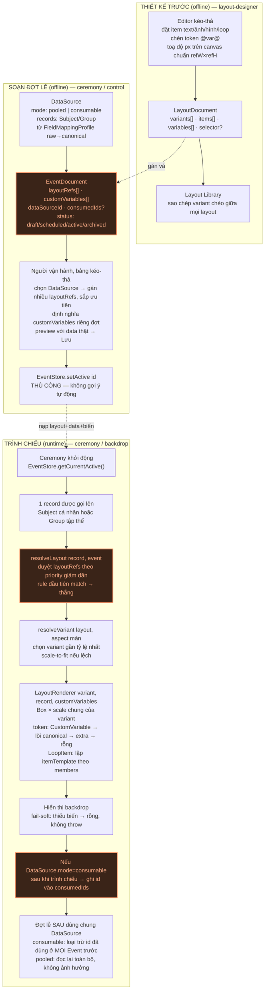

# 14 — Rà soát toàn bộ blueprint (2026-07-15)

> Đọc lại 13 file (00→13) sau khi khái niệm Event/DataSource/LoopItem được thêm vào giữa
> chừng, tìm mâu thuẫn giữa các quyết định viết ở thời điểm khác nhau, và vẽ lại sơ đồ luồng
> tổng thể để xác nhận mọi thứ thực sự khớp nhau.

## Sơ đồ luồng hoạt động tổng thể

**Bản đầy đủ, có màu theo lane + ghi chú field chi tiết trong từng box:**
[14-luong-tong-the.svg](14-luong-tong-the.svg) — mở trực tiếp trong trình duyệt/VS Code preview.

Bản Mermaid dưới đây đơn giản hơn (không màu lane, không ghi chú field), nhưng là text thuần
nên đọc được ngay trong terminal/git diff mà không cần mở file ảnh riêng:



**Chú thích 2 điểm đánh dấu cam trên sơ đồ** — không phải lỗi vẽ, mà là 2 chỗ blueprint hiện
mô tả chưa đủ rõ để chuyển thẳng sang code (xem chi tiết ở mục "Thiếu logic vận hành" bên dưới):
`B2` (EventDocument — field `selector`/`dataSourceId` mâu thuẫn giữa các file), `C3` (thứ tự
chọn layout vs chọn variant chưa xác nhận), `C7` (ai/khi nào ghi `consumedIds` chưa có trigger).

## 1. Mâu thuẫn schema — nên sửa trước khi code

### #1 — `selector` sống ở 2 nơi khác nhau: `LayoutDocument` hay `EventLayoutRef`?

**File liên quan:** 04, 06, 10, 13

File 04/06 định nghĩa `selector?: LayoutSelector` là thuộc tính của chính `LayoutDocument` —
nghĩa là 1 layout tự mang điều kiện chọn nó. Nhưng ví dụ JSON ở file 13 lại gán `selector` cho
từng phần tử trong `EventLayoutRef[]` — nghĩa là Event quyết định điều kiện, không phải layout.
File 10 (nơi khai báo gốc `EventLayoutRef`) **không hề có field `selector`** trong interface:

```ts
// file 10 — EventLayoutRef thật:
export interface EventLayoutRef {
  layoutId: string;
  overrides?: Partial<Pick<LayoutVariant, 'background'>>[];
}
// KHÔNG có "selector" — nhưng file 13 dùng:
{ layoutId: "gpa-xuat-sac", selector: {...}, priority: 100 }
```

**Cần xác nhận:** điều kiện chọn layout thuộc về layout hay thuộc về Event? Đề xuất nghiêng
**Event** (vì cùng 1 layout hình có thể áp dụng điều kiện khác nhau ở đợt lễ khác nhau — khớp
nguyên tắc "layout thuần hình, không chứa nghiệp vụ" đã chốt xuyên suốt) — nhưng đây là quyết
định kiến trúc, cần chốt trước khi sửa lại field cho khớp cả 4 file.

### #2 — `dataSourceId`: optional ở 1 file, bắt buộc ở file khác

**File liên quan:** 10, 13

Cùng field trong cùng interface `EventDocument`, 2 nơi khai khác nhau:

```ts
// file 10, dòng ~119
dataSourceId?: string;   // CÓ dấu ? — optional

// file 13, dòng ~82
dataSourceId: string;    // KHÔNG dấu ? — bắt buộc
```

**Cần xác nhận:** 1 Event có được tồn tại mà chưa gán nguồn data không (VD tạo Event trước,
import data sau)? Nếu có → optional đúng. Đề xuất nghiêng **optional** (khớp nguyên tắc "layout
thiết kế trước, độc lập data" — Event cũng nên tạo được khung trước, gán data sau).

### #3 — `LoopItem` chưa thực sự có trong union `LayoutItem`

**File liên quan:** 04, 11

File 04 định nghĩa union `LayoutItem = TextItem | ImageItem | ShapeItem | RibbonItem`. File 11
(viết sau) thêm hẳn `LoopItem` với overflow/itemTemplate/gap — nhưng chưa từng được cộng vào
union ở file 04. Ai đọc riêng file 04 sẽ không biết `LoopItem` tồn tại. Chính file 11 tự ghi
vào checklist "cần thêm LoopItem vào union" — nhận là việc chưa làm.

→ Việc dọn dẹp thuần tuý, không cần hỏi lại.

## 2. Tên field đổi rồi nhưng chưa lan hết

Khi 1 field đổi tên ở file mới nhất, các file cũ hơn thường còn sót bản cũ vì blueprint không
có bước "tìm-thay toàn cục". Không phải bất đồng ý kiến — chỉ là quét chưa hết.

| Tên cũ → mới | Còn sót ở | Đã đúng ở |
|---|---|---|
| `dataSnapshotId` → `dataSourceId` | file 09 dòng 195 · file 10 dòng 143, 199 | file 10 dòng 119 · file 13 (toàn bộ) |
| "ceremony định nghĩa custom_variables" → "Event định nghĩa" | file 09 §4 (dòng 275–303), checklist cuối file | file 09 §2.5, §3 · file 10 · file 13 |
| Câu hỏi A7/A8/A9/A10 đã ✅ ở file 08 — nhưng bản gốc câu hỏi vẫn còn nguyên | file 10, mục "Câu hỏi mở" cuối file (dòng 211–226) — 4 câu hỏi trùng lặp, 1 câu (A9) còn nêu ngược lại phương án "bán tự động" đã bị chính A9 phủ quyết | file 08 (A7–A10 đều ✅) |
| `LayoutSelector.priority`: optional → thực chất bắt buộc khi nhiều layoutRefs | file 06 dòng 67 (vẫn `priority?: number`) | file 13 nói rõ nên bắt buộc, nhưng chưa quay lại sửa file 06 |
| `FieldMappingProfile.targetType`: union đóng → `subjectType` mở | file 05 dòng 62 (vẫn `'student'\|'employee'\|'generic'`) | file 11 đã đổi tư duy nhưng chưa quay lại sửa file 05 |
| Toạ độ `%` → `px` trên canvas chuẩn + scale | file 07 (toàn bộ luồng vẫn mô tả % + "convert sang % khi lưu") — **chưa từng được sửa lại** sau quyết định đổi sang px ở file 04 | file 04 (chốt chính thức) |

## 3. Chỗ luồng chưa nói rõ ai làm / dữ liệu từ đâu

Vẽ sơ đồ ở trên giúp lộ ra những bước có tên nhưng chưa có "công thức" — nghĩa là 1 hàm được
nhắc tới nhưng input/output chưa đủ rõ để viết code.

### #9 — Thứ tự "chọn layout theo điều kiện" và "chọn variant theo tỷ lệ màn" — cái nào trước?

**File liên quan:** 04, 13

File 13 viết code mẫu ngầm định chọn layout trước (theo priority/GPA/giới tính) rồi mới chọn
variant theo tỷ lệ màn thật. Nhưng không nơi nào bàn: nếu layout ưu tiên cao nhất (đúng nghiệp
vụ nhất) chỉ có variant 16:9, còn màn thật là 25:9 — trong khi layout ưu tiên thấp hơn lại có
variant 25:9 khớp hoàn hảo — hệ thống có nên "hạ cấp" ưu tiên nghiệp vụ để đổi lấy hình đẹp
hơn không?

**Cần xác nhận:** ưu tiên nghiệp vụ luôn thắng, chấp nhận variant lệch tỷ lệ (letterbox) — hay
ưu tiên hình đẹp hơn nghiệp vụ khi lệch quá xa? Đề xuất: **nghiệp vụ luôn thắng**, letterbox
chỉ là lưới an toàn — khớp tinh thần xuyên suốt của thiết kế px+scale (chấp nhận phải thiết kế
thêm variant nếu muốn đẹp, không để hệ thống tự ý đổi kết quả nghiệp vụ).

### #11 — `EventLayoutRef.overrides` là mảng — không rõ phần tử nào ứng với variant nào

**File liên quan:** 10

```ts
overrides?: Partial<Pick<LayoutVariant, 'background'>>[]; // theo từng variant
```

Comment ghi "theo từng variant" nhưng không có khoá liên kết (aspect id) để biết phần tử thứ N
override variant nào. Nếu layout có `[16:9, 25:9]` mà Event chỉ muốn đổi background của `25:9`,
mảng phẳng không biểu diễn được "chỉ override cái này, giữ nguyên cái kia" an toàn — dựa vào
thứ tự mảng dễ lệch nếu layout gốc đổi thứ tự variant.

→ Đề xuất sửa thành `Record<aspectId, Partial<Pick<LayoutVariant,'background'>>>` — sửa kỹ
thuật thuần tuý để khớp ý đã có, không cần hỏi lại.

### #14 — `DataSource.records` không biểu diễn được việc trộn cá nhân + tập thể trong 1 đợt

**File liên quan:** 11, 13

File 13 khai `records: CanonicalSubject[] | CanonicalGroup[]` — đây là "1 trong 2 loại mảng
thuần", không phải mảng trộn lẫn. Nhưng chính file 11 nêu rõ use case: *"1 đợt lễ có thể vừa
trao cá nhân vừa trao tập thể"* — nghĩa là cần 1 mảng chứa lẫn cả 2 loại record trong cùng 1
`DataSource`, kiểu đúng phải là `Array<CanonicalSubject | CanonicalGroup>`.

→ Lỗi kiểu dữ liệu rõ ràng so với chính use case đã chốt — sửa thành mảng trộn, không cần hỏi lại.

### #15 — Ai cập nhật `consumedIds`, lúc nào — và `record.mode` không tồn tại

**File liên quan:** 13

Văn bản viết "nếu `record.mode`='consumable' → sau khi trình chiếu xong, thêm id vào
`consumedIds`" — nhưng `mode` là thuộc tính của `DataSource`, record không có field này. Ngoài
lỗi diễn đạt, còn thiếu: **ai/khi nào** gọi hành động ghi `consumedIds` — cuối bài phát biểu?
Khi người vận hành bấm "tiếp theo"? Khi hết thời lượng slide? Chưa có trigger rõ ràng.

**Cần xác nhận:** thời điểm "đã trao xong 1 người/nhóm" nên tính từ đâu — khi ceremony chuyển
sang record tiếp theo (tự động, dựa vào luồng vận hành đã có sẵn: checked_in → called →
on_stage → returned), hay cần 1 nút bấm riêng "Đánh dấu đã trao"? Đề xuất: dùng lại đúng trạng
thái `returned` đã có sẵn trong `Student.status` hiện tại — không cần thêm hành động mới.

### #16 — Không match layout nào — màn hình hiện gì? (rủi ro vận hành, xảy ra giữa lễ)

**File liên quan:** 13

Chính file 13 tự liệt vào câu hỏi mở, chưa trả lời: khi `resolveLayout` trả về `null` (không
layout nào match — kể cả "default" cũng thiếu), ceremony hiển thị gì? Đây là kịch bản có thể
xảy ra thật giữa buổi lễ (data lỗi, thiếu layout default) — mức rủi ro cao hơn các câu hỏi mở
khác vì hậu quả là màn hình đen trước khách mời.

**Cần xác nhận:** đề xuất — luôn bắt buộc mỗi Event phải có 1 layoutRef với `selector: {rules:
[]}` (match mọi thứ, priority thấp nhất) làm lưới an toàn cuối cùng, **validate chặn lúc lưu
Event** nếu thiếu — thay vì xử lý runtime "không tìm thấy thì làm gì". Hướng chặn từ lúc soạn
an toàn hơn xử lý lúc chạy.

## 4. Toàn bộ điểm cần xác nhận lại — ĐÃ CHỐT TOÀN BỘ (2026-07-15, trao đổi tiếp theo)

> 6/7 điểm đã chốt xong và cập nhật vào schema; #56 chỉ còn là việc "làm sau" (không phải
> quyết định treo). Giữ bảng dưới đây làm log quyết định — cột "Chốt" là quyết định CUỐI CÙNG,
> có thể khác đề xuất ban đầu của tôi.

| Mã | Câu hỏi | Đề xuất ban đầu | **Chốt** | Đã sửa ở |
|---|---|---|---|---|
| #1 | Điều kiện chọn layout (`selector`) thuộc về `LayoutDocument` hay `EventLayoutRef`? | Nghiêng Event | **Event.** "Design layout chỉ quản lý danh sách layout; điều kiện chọn ở ceremony." | file 04, 06, 10, 13 |
| #2 | Event có được tạo trước, gán data sau không? | Optional | **Optional — đúng.** User tạo Event/layout trước, data có thể chưa chốt số lượng/danh sách, import/map sau. | file 10, 13 |
| #9 | Layout đúng điều kiện nhất nhưng lệch tỷ lệ màn — xử lý sao? | Nghiệp vụ thắng, letterbox an toàn | **Không letterbox.** Thiết kế + sử dụng đều chọn theo tỷ lệ màn; thiếu tỷ lệ đúng thì HOẶC quay lại thêm variant, HOẶC chấp nhận stretch (kéo giãn/co méo) variant gần nhất. | file 04 |
| #15 | Thời điểm ghi `consumedIds`? | Tự động theo trạng thái `returned` | **Không cơ chế tự động nào cả.** Người dùng tự mở, tự quản lý — không gắn vào việc chạy đợt/Event. | file 10, 13 |
| #16 | Không match layout nào giữa lễ — chặn lúc soạn hay xử lý runtime? | Chặn lúc soạn (validate bắt buộc default) | **Không chặn gì.** User tự chuẩn bị, tự chịu trách nhiệm — đổi lại hệ thống cung cấp **Import/Export** đầy đủ (layout, Event, variable, data) để họ chủ động kiểm tra trước. → phát sinh yêu cầu mới, xem file 15. | file 06, 10, 13, **file 15 mới** |
| #53 | Selector chỉ AND phẳng — có cần OR lồng không? | Chưa rõ, cần ví dụ | **Có — thêm AND/OR.** `LayoutSelector.groups[]` (OR giữa các group, AND trong 1 group) để linh động hơn. | file 06, 13 |
| #56 | Danh sách font cụ thể? | Cần cung cấp trước khi implement | **Bổ sung sau — không chặn.** Chỉ cần đảm bảo cơ chế đổi font được (không hardcode 1 font), danh sách cụ thể làm khi implement thật. | file 04, 08 |

## 5. Việc tự sửa — ĐÃ HOÀN TẤT (2026-07-15, cùng lượt chốt 7 điểm ở mục 4)

- [x] Gộp `LoopItem` vào union `LayoutItem` ở file 04 (chỉ khai tên, định nghĩa đầy đủ vẫn ở
      file 11 — tránh 2 nguồn định nghĩa lệch nhau).
- [x] Dọn field `dataSnapshotId` còn sót — file 10 (dòng ~154, ~210), thành `dataSourceId`.
      File 09 dòng 195 vẫn còn — **chưa dọn**, thêm vào việc tự sửa còn lại bên dưới.
- [ ] Xoá/đánh dấu các câu hỏi đã ✅ nhưng bản gốc còn treo ở file 10 (mục "Câu hỏi mở" cuối
      file) — **chưa làm**, việc dọn dẹp nhỏ còn sót.
- [x] Sửa `EventLayoutRef.overrides` từ mảng phẳng sang `Record<aspectId, ...>` — xong ở file 10.
- [x] Sửa `DataSource.records` từ union-2-mảng sang mảng trộn `Array<CanonicalSubject | CanonicalGroup>`
      — xong ở file 13.
- [ ] Cập nhật lại file 07 (luồng cũ, đang mô tả `%`) theo quyết định `px + scale` đã chốt ở
      file 04 — **chưa làm**.
- [ ] Đồng bộ `FieldMappingProfile.targetType` (file 05) thành `subjectType: string` mở, khớp
      file 11 — **chưa làm**.
- [x] Sửa câu văn sai chủ ngữ "`record.mode`" thành "`DataSource.mode`" — xong ở file 13.
- [x] Cập nhật `LayoutSelector.priority` (file 06) từ optional sang bắt buộc — xong (kèm đổi
      `rules[]` phẳng thành `groups[]` để hỗ trợ AND/OR theo #53).

**Việc mới phát sinh khi sửa (thêm vào danh sách tự sửa, chưa làm):**
- [ ] `EventStore`/`LayoutStore` đã thêm `exportBundle`/`importBundle` (file 06, 10) — cần
      viết type `LayoutExportBundle`/`EventExportBundle` đầy đủ (hiện mới có ở file 15 dạng
      draft, chưa đối chiếu ngược lại 2 file store).
- [ ] File 08 (A2, A3) còn 1-2 câu hỏi phụ lỗi thời cần dọn theo cùng đợt (VD A2 đã đóng nhưng
      còn dòng tham chiếu "px viền mảnh" từ trước khi chốt hẳn px toàn phần).

## Nguồn

Sơ đồ đầy đủ (màu theo lane, ghi chú field, đường nối cross-lane) lưu tại
[14-luong-tong-the.svg](14-luong-tong-the.svg) trong cùng thư mục — mở trực tiếp bằng trình
duyệt hoặc preview của VS Code. Bản Mermaid ở đầu file này là bản rút gọn để đọc nhanh trong
terminal/git diff. Cả 2 vẽ cùng 1 luồng, chỉ khác mức chi tiết hiển thị.
