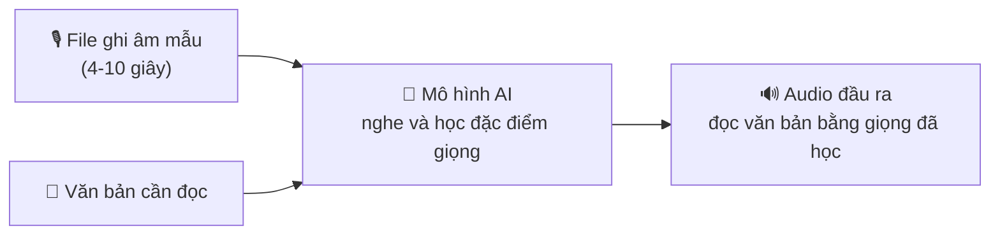
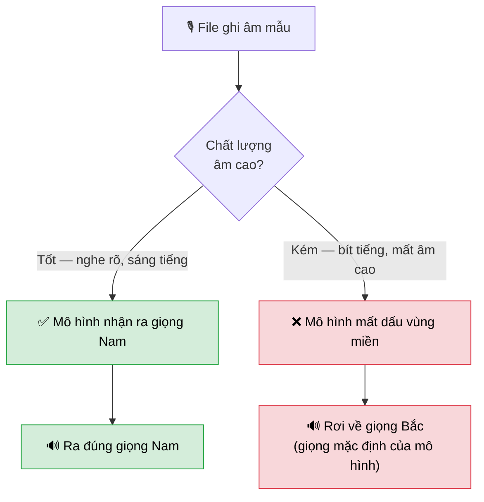
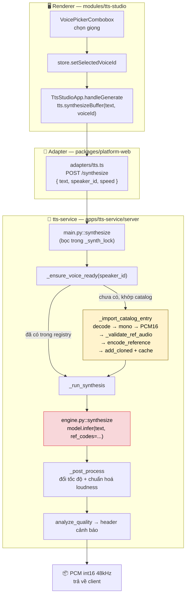
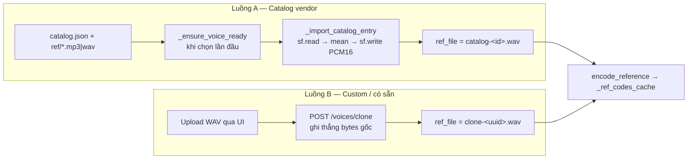

# TTS — Clone giọng và vấn đề sai vùng miền (accent)

> **Tóm tắt một câu:** Chọn giọng nam miền Nam nhưng máy đọc ra giọng miền Bắc — nguyên nhân **không phải lỗi code**, mà do **chất lượng file ghi âm mẫu** quá kém, làm mô hình mất dấu hiệu nhận biết vùng miền.
>
> Điều tra ngày 27/07/2026. Tài liệu này gồm 2 phần: **Phần A** viết cho mọi người, **Phần B** viết cho lập trình viên và AI cần chi tiết kỹ thuật.

---

# PHẦN A — Giải thích dễ hiểu

## A1. Vấn đề là gì?

Trong app **TTS Studio**, người dùng chọn một giọng đọc rồi nhập văn bản để máy đọc thành audio.

Vấn đề: chọn giọng **Bảo Ngọc** (nữ, miền Nam) hoặc **Trúc Lam** (nam, miền Nam), nhưng audio tạo ra lại là **giọng miền Bắc**. Giới tính thì đúng (nam vẫn ra nam), chỉ có chất giọng vùng miền bị đổi.

Trong khi đó, giọng **Gia Huy** (cũng nam miền Nam) lại hoạt động hoàn toàn bình thường.

## A2. Hệ thống hoạt động thế nào?

Máy **không** có sẵn giọng nói của từng người. Thay vào đó, nó dùng kỹ thuật gọi là **clone giọng**: bạn đưa cho nó một đoạn ghi âm mẫu (4–10 giây) của người đó, nó nghe rồi bắt chước.



Điểm mấu chốt: **mô hình chỉ biết những gì có trong file ghi âm mẫu**. File mẫu tốt thì bắt chước tốt, file mẫu tệ thì bắt chước sai.

## A3. Vì sao lại sai vùng miền?

Hãy hình dung thế này:

> Bạn nhờ một người bắt chước giọng của bạn bè, nhưng chỉ cho họ nghe qua **điện thoại cũ, sóng rè**. Họ vẫn đoán được đó là nam hay nữ, giọng cao hay trầm — vì đó là đặc điểm **dễ nhận**. Nhưng những chi tiết **tinh tế** như cách phát âm đặc trưng vùng miền thì đã bị sóng rè làm mất. Không có thông tin, họ đành nói theo giọng quen thuộc nhất của chính họ.

Mô hình AI cũng vậy. Đặc trưng vùng miền nằm ở các **âm cao** — tiếng "s", "x", "tr", "ch", các âm cuối. Nếu file ghi âm bị mất phần âm cao (nghe "bít bít", như nói qua chăn), mô hình không còn căn cứ để biết đây là giọng Nam, nên nó rơi về giọng phổ biến nhất mà nó từng học: **giọng Bắc**.



## A4. Bằng chứng — thí nghiệm quyết định

Đây không phải suy đoán. Chúng tôi đã chứng minh bằng thí nghiệm có đối chứng:

1. Lấy một file mẫu **chuẩn** (giọng nam miền Nam, do chính tác giả thư viện cung cấp) → clone ra **đúng giọng Nam** ✅
2. Lấy **chính file đó**, chỉ làm một việc duy nhất: **cắt bỏ phần âm cao** (mô phỏng đúng độ "bít tiếng" của file bị lỗi) → clone ra **giọng Bắc** ❌

Cùng một người nói, cùng nội dung, cùng hệ thống. Chỉ khác chất lượng âm thanh. Kết quả đảo ngược hoàn toàn.

## A5. Những gì KHÔNG phải nguyên nhân

Trước khi tìm ra nguyên nhân thật, chúng tôi đã loại trừ từng khả năng bằng thử nghiệm thực tế:

| Nghi ngờ ban đầu | Cách kiểm tra | Kết luận |
|---|---|---|
| File MP3 kém hơn WAV | Thử file WAV chuẩn, vẫn lỗi | ❌ Không phải |
| Code chọn nhầm giọng | Đọc log server, đúng ID | ❌ Không phải |
| Hai luồng đăng ký giọng khác nhau | Thử cả hai, kết quả giống hệt | ❌ Không phải |
| Kết quả ngẫu nhiên | Chạy lại 3 lần, đều như nhau | ❌ Không phải |
| Văn bản dài/ngắn | Thử cả hai, đều lỗi | ❌ Không phải |
| File ghi âm bị pha giọng | Nghe trực tiếp file gốc, thuần Nam | ❌ Không phải |
| **Chất lượng ghi âm (mất âm cao)** | **Cắt âm cao file tốt → hỏng ngay** | ✅ **Chính là nguyên nhân** |

## A6. Phát hiện bất ngờ

Khi quét toàn bộ các file ghi âm mẫu, chúng tôi phát hiện file **Lan Anh** cũng bị bít tiếng y hệt file lỗi — nhưng xưa nay không ai thấy có vấn đề.

Lý do: **Lan Anh vốn là giọng Bắc**. Khi mô hình mất dấu vùng miền, nó rơi về giọng Bắc — tình cờ trùng đúng với giọng cần có. Lỗi vẫn xảy ra, chỉ là **không ai nhận ra**.

Điều này giải thích vì sao vấn đề chỉ lộ ra với giọng miền Nam.

## A7. Kết quả kiểm tra toàn bộ kho giọng

Quét 44 file giọng trong kho:

| Kết quả | Số lượng |
|---|---|
| ✅ Đạt chuẩn | **1** |
| ⚠️ Dùng được nhưng có rủi ro | 22 |
| ❌ Không đạt, nên thay | **21** |

Nói cách khác: **kho giọng có sẵn về cơ bản không đủ chất lượng** để clone chính xác. Đây mới là gốc rễ vấn đề.

## A8. Nên làm gì?

**Cách 1 — Dùng giọng dựng sẵn (nhanh nhất, đã kiểm chứng).**
Mô hình có sẵn 10 giọng "đóng gói cứng" bên trong, không cần file ghi âm mẫu nên miễn nhiễm hoàn toàn với vấn đề này. Các giọng này đang bị ẩn khỏi giao diện. Đã test giọng `preset-GiaBao` → ra đúng giọng Nam. Chỉ cần bật hiện lên là dùng được.

**Cách 2 — Thu lại file mẫu cho những giọng thực sự cần.**
Đây là cách dứt điểm. Yêu cầu:

- 🎤 Micro tốt, đặt cách miệng 20–30cm
- 🏠 Phòng yên tĩnh, nhiều đồ mềm (rèm, chăn, tủ quần áo) để giảm tiếng vang
- 🚫 Không nhạc nền, tắt quạt/điều hoà
- ⏱️ Đọc tự nhiên 4–10 giây
- 💾 Lưu thẳng ra file **WAV**, không qua Zalo/Messenger/ghi âm điện thoại (những thứ này nén mất âm cao)

**Cách 3 — Kiểm tra trước khi dùng.**
Đã có sẵn công cụ tự động chấm điểm file ghi âm (xem [B6](#b6--công-cụ-kiểm-tra-file-ghi-âm)). Chạy trước khi thêm giọng mới để biết ngay file có đạt không.

> ⚠️ **Lưu ý quan trọng:** File đã bị mất âm cao thì **không thể sửa bằng phần mềm**. Âm thanh đã mất thì không tạo lại được. Bắt buộc phải thu lại từ đầu.

---

# PHẦN B — Chi tiết kỹ thuật

## B1. Vì sao kiến trúc này nhạy cảm với chất lượng bản ghi

VieNeu v3 Turbo clone giọng theo cơ chế **in-context**, khác hẳn cách nhiều hệ thống khác làm.

File ref được mã hoá thành **token âm thanh** (MOSS codec), rồi các token đó được **nối thẳng vào prompt** cùng token văn bản — xem [`_build_rows`](../../apps/tts-service/venv/lib/python3.13/site-packages/vieneu/_v3_turbo_engine/onnx_runtime_lite.py) (dòng 183–195):

```python
rows = np.full((T, self.n_vq + 1), self.audio_pad, dtype=np.int64)
rows[:, 0] = text_ids
...
ref[:, 0] = self.ref_slot
ref[:, 1:] = rc                       # ref codes nối vào sau text
return np.concatenate([rows, ref], axis=0)
```

Hệ quả: model **không trích xuất "danh tính giọng" rồi bỏ phần còn lại đi**. Nó nghe nguyên đoạn audio đó như ngữ cảnh, rồi **sinh tiếp trong cùng khung âm học ấy**. Bản ghi bít tiếng → token bít tiếng → đầu ra thừa hưởng sự nghèo nàn đó.

Đặc trưng **thô** (F0/cao độ, giới tính) nằm ở dải tần thấp nên còn nguyên. Đặc trưng **tinh** (accent — thể hiện qua phụ âm xát, âm cuối, ngữ điệu ở dải trung–cao) bị mất trước tiên. Mất tín hiệu → model rơi về prior trội trong dữ liệu huấn luyện: **giọng Bắc**.

Đối chiếu: phần lớn dịch vụ thương mại dùng **speaker encoder chuyên dụng** (ECAPA/x-vector) huấn luyện với mục tiêu *cố ý loại bỏ* kênh truyền/nhiễu/vang, chỉ giữ danh tính — bền vững hơn nhiều với bản ghi kém. Kèm theo đó là bước **enhancement** (khử nhiễu, khử vang, mở rộng băng thông) trước khi clone.

## B2. Luồng dữ liệu đầy đủ



Điểm mất accent nằm ở khối màu đỏ (`model.infer`) — nhưng **nguyên nhân** đã nằm sẵn trong `ref_codes` được tạo từ file ref kém chất lượng.

### Neo mã nguồn

| Bước | Vị trí |
|---|---|
| UI gọi tạo giọng | [`TtsStudioApp.tsx:234`](../../modules/tts-studio/src/TtsStudioApp.tsx#L234) |
| Adapter gửi request | [`platform-web/src/adapters/tts.ts:65-74`](../../packages/platform-web/src/adapters/tts.ts#L65-L74) |
| Endpoint synthesize | [`main.py:735`](../../apps/tts-service/server/main.py#L735) |
| Resolve giọng, auto-import | [`main.py:515`](../../apps/tts-service/server/main.py#L515) |
| Convert + encode ref | [`main.py:456`](../../apps/tts-service/server/main.py#L456) |
| Validate ref (nơi cắm cảnh báo) | [`main.py:542`](../../apps/tts-service/server/main.py#L542) |
| Chọn ref_codes + infer | [`main.py:696`](../../apps/tts-service/server/main.py#L696) |
| Engine wrapper | [`engine.py:242`](../../apps/tts-service/server/engine.py#L242) |
| Registry giọng | [`voice_registry.py`](../../apps/tts-service/server/voice_registry.py) |

## B3. Hai luồng đăng ký giọng (đã xác nhận **không** phải nguyên nhân)



Khác biệt duy nhất: luồng A decode-rồi-ghi-lại, luồng B ghi thẳng bytes. **Đã kiểm chứng bằng thực nghiệm là không ảnh hưởng:** cùng file `gia_bao.wav` đi qua cả hai luồng cho ra `ref_codes` **giống hệt** (cùng shape `(61, 16)`) và audio đầu ra không phân biệt được. Với file WAV mono sẵn có, bước re-encode là **byte-for-byte identical** (`np.allclose` sai số chỉ do lượng tử PCM16, ~3e-5).

## B4. Bộ chỉ số và hiệu chuẩn ngưỡng

### Chỉ số đã thử và **loại bỏ**

| Chỉ số | Lý do loại |
|---|---|
| Năng lượng dải 4–8kHz | Không tách được nhóm: `gia_bao` (hỏng) đạt **7.2%**, cao hơn `Vĩnh` (tốt) **4.5%** — vì vách cắt rơi đúng ~5.5kHz nên phần 4–5.5kHz vẫn dày |
| rolloff 95% | Bị chi phối bởi phân bố năng lượng tần thấp → giọng nam trầm thu tốt (`nam-nam`: 5637Hz) trông "tệ" hơn cả file hỏng |
| SNR / nhiễu nền | Tương quan nhưng **không đủ**: `bao_ngoc` sạch (75dB) mà vẫn lỗi |
| Băng thông tổng (bandwidth extension) | Đã test band-limit 24kHz→48kHz trên `gia_bao`: **không cải thiện** |

### Chỉ số **giữ lại** — dữ liệu hiệu chuẩn thật

| File | Thực tế | Cắt ở (Hz) | >8kHz (%) | Vang (%) | SNR (dB) |
|---|---|---|---|---|---|
| `samples/Vĩnh` | ✅ đúng Nam | 11660 | 5.2 | 10 | 60 |
| `adam-low-tone.wav` | ✅ đúng | 11355 | 5.2 | 9 | 97 |
| `nu-bac-2.wav` | ✅ đúng | 11039 | 4.6 | 10 | 109 |
| `nam-nam.wav` (Gia Huy) | ✅ đúng Nam | 10945 | 2.5 | 10 | 73 |
| `nu-nam.wav` | ⚠️ lơ lớ | 11672 | 5.7 | **21** | **44** |
| `bao_ngoc_gentle.mp3` | ❌ lệch | 11413 | 10.5 | 9 | 75 |
| `truc_lam.mp3` | ❌ lệch | 12317 | 3.0 | **41** | 36 |
| `gia_bao.wav` | ❌ lệch | **8086** | **0.4** | 14 | 33 |
| `vinh_muffled.wav` *(thí nghiệm nhân quả)* | ❌ lệch | **4945** | **0.1** | 10 | 60 |
| `nu-bac.wav` (Lan Anh) | ⚠️ lỗi bị che | **5227** | **0.1** | 15 | 34 |

**Tần số cắt** tách sạch nhất: nhóm tốt 10.9–12.3kHz, nhóm bít tiếng 4.9–8.1kHz — khoảng trống rộng.

### Ngưỡng đang dùng

```python
CUTOFF_FAIL, CUTOFF_WARN   = 9000.0, 10000.0   # Hz
BAND_8K_FAIL, BAND_8K_WARN = 1.2, 2.2          # % tổng năng lượng
REVERB_FAIL, REVERB_WARN   = 25.0, 16.0        # % khung ở đuôi vang
SNR_FAIL, SNR_WARN         = 30.0, 50.0        # dB
MIN_USABLE_NYQUIST         = 9000.0            # Hz — sample rate < 18kHz không đánh giá được
```

### Về `nu-bac.wav` — vì sao lỗi bị che

`nu-bac.wav` (Lan Anh) bít tiếng ngang `gia_bao` nhưng "vẫn chạy tốt" suốt thời gian qua. Không mâu thuẫn: Lan Anh là giọng **Bắc**, mà prior model rơi về khi mất dữ liệu **cũng là Bắc**. Cùng khiếm khuyết đó trên giọng Nam thì lộ ngay.

→ Bài học: **kiểm tra chất lượng bản ghi, đừng dựa vào "nghe có vẻ ổn"** — với giọng Bắc, tai người không phát hiện được lỗi này.

## B5. Điểm mù đã biết của bộ chỉ số

`bao_ngoc_gentle.mp3` **qua được mọi ngưỡng âm học** (cắt 11.4kHz, >8kHz 10.5%, vang 9%, SNR 75dB) nhưng clone vẫn lệch. Script chỉ hạ nó xuống mức *cảnh báo* nhờ luật "nguồn nén lossy".

Giả thuyết (**chưa kiểm chứng**): artifact nén MP3 128kbps cộng lối đọc thì thầm ("gentle") nằm ngoài phân phối huấn luyện. Chưa có chỉ số nào bắt được.

→ Kết luận đúng mực: **ĐẠT = "không có lỗi đã biết"**, không phải "chắc chắn clone đúng".

## B6 — Công cụ kiểm tra file ghi âm

[`apps/tts-service/server/check_ref_audio.py`](../../apps/tts-service/server/check_ref_audio.py)

```bash
cd apps/tts-service/server
../venv/bin/python3 check_ref_audio.py file.wav           # 1 file
../venv/bin/python3 check_ref_audio.py duong/dan/ref/     # cả thư mục
../venv/bin/python3 check_ref_audio.py file.wav --json    # cho CI/script
../venv/bin/python3 check_ref_audio.py file.wav --quiet   # chỉ hiện lỗi
```

Exit code `0` = đạt hoặc chỉ cảnh báo, `1` = có file không đạt (dùng được trong CI).

Ví dụ đầu ra:

```
gia_bao.wav
  KẾT LUẬN: KHÔNG ĐẠT — nên thu lại, clone sẽ dễ sai accent
  [XX] Băng thông       cắt ở 8086Hz  >8kHz=0.4%
       → Bản ghi BỊ BÍT TIẾNG — mất dải phụ âm mang đặc trưng vùng miền...
  [OK] Vang phòng       đuôi vang=14%  im lặng sạch=9%
  [XX] Nhiễu nền        SNR≈33dB
```

Kết quả quét kho catalog (44 file): **1 đạt / 22 cảnh báo / 21 không đạt**. Chia theo nguyên nhân:

- **Bít tiếng (13 file)** — nặng nhất `emma_calm` (cắt 3230Hz), `huy_le_calm` (4177Hz), `minh_anh_narrator` (5227Hz). **Không cứu được bằng hậu kỳ.**
- **Vang phòng (8 file)** — `truc_lam` (41%), `thuy_tien_narrator` (38%), `quang_nguyen_dynamic` (35%). **Có thể cứu bằng khử vang.**

## B7. Hướng cải tiến, xếp theo hiệu quả trên công sức

### 1. Mở 10 giọng preset đang ẩn — *đã kiểm chứng, rẻ nhất*

Preset dùng **speaker token nhúng sẵn trong model** (đường `reserved_id`), không qua ref audio → miễn nhiễm hoàn toàn với cả lớp vấn đề này. Đã test `preset-GiaBao` → đúng giọng Nam.

Cả 10 preset khai báo tại [`voice_registry.py:52-63`](../../apps/tts-service/server/voice_registry.py#L52-L63), đều gắn `region: "Nam"`, hiện `hidden: true`.

> ⚠️ **Bẫy khi triển khai:** sửa mặc định trong `PRESET_VOICES` là **chưa đủ**. [`_load_or_init`](../../apps/tts-service/server/voice_registry.py#L94-L97) chỉ thêm preset còn *thiếu*, không cập nhật cờ `hidden` của entry đã tồn tại trong registry cũ. Cần migration hoặc gọi `PUT /voices/{id}`.

Nên nghe thử cả 10 rồi mở những giọng đạt.

### 2. Cắm cảnh báo chất lượng vào server — *ngăn tái diễn*

Port logic của `check_ref_audio.py` vào [`_validate_ref_audio`](../../apps/tts-service/server/main.py#L542). Hạ tầng đã sẵn: hàm này vốn trả list cảnh báo và UI đã hiển thị.

Đây đúng là phần mà comment tại [`engine.py:37`](../../apps/tts-service/server/engine.py#L37) ghi *"KHÔNG bắt được: lẫn giọng Bắc/Nam (cần speaker embedding — để giai đoạn sau)"*.

### 3. Thu lại ref cho giọng thực sự cần — *dứt điểm*

Tiêu chí rút ra từ dữ liệu (mục B4). Chạy `check_ref_audio.py` xác nhận trước khi đưa vào dùng.

### 4. Thêm bước enhancement trước encode — *cứu được một phần*

Chèn khử nhiễu + khử vang giữa bước đọc file và `encode_reference`.

Cần thành thật về giới hạn:
- ✅ Khử nhiễu / khử vang: công nghệ trưởng thành → cứu được 8 file lỗi vì vang phòng
- ⚠️ Bít tiếng: cần *bandwidth extension*, model sẽ **bịa** ra tần số cao đã mất → kết quả bấp bênh, **không đảm bảo** phục hồi đúng đặc trưng accent. Thí nghiệm band-limit đơn giản đã cho thấy không cải thiện

Tham chiếu: VoxCPM có sẵn tính năng "Prompt Speech Enhancement" đúng theo hướng này → xác nhận đây là thực hành chuẩn của ngành.

### 5. Đổi/thêm engine — xem B8

## B8. Đánh giá VoxCPM theo hướng tải-theo-nhu-cầu

### Hạ tầng on-demand đã có sẵn

Dự án **đã dựng xong** cơ chế engine mở rộng tải theo nhu cầu, có tiền lệ chạy thật là `moss-tts-nano`:

- [`engine_registry.py`](../../apps/tts-service/server/engine_registry.py) — khai báo engine + manifest `install` (runtime pip, model, requirements)
- [`engine-installer.ts`](../../apps/shell-electron/electron/slide/engine-installer.ts) — preflight kiểm đĩa/RAM/GPU/on-stage/mạng trước khi cho tải
- [`verify_engine.py`](../../apps/tts-service/server/verify_engine.py) — dry-run xác nhận engine load được **trước** khi cho đổi sang
- Cài vào `userData/tts-engines/<id>/{runtime, model, manifest.json}`

Chuẩn so sánh — `moss-tts-nano`: **~700MB**, torch-free ONNX, `min_ram_gb: 2`, `needs_gpu: false`.

### Các biến thể VoxCPM

| Biến thể | Dung lượng | Torch-free? | Tiếng Việt | RTF (CPU) | Kết luận |
|---|---|---|---|---|---|
| VoxCPM-0.5B (GGUF Q4_K) | 477MB | ✅ (C++ ggml) | ❌ **chỉ Trung/Anh** | 3.6 | **Loại** — không có tiếng Việt |
| VoxCPM1.5 (GGUF Q4_K) | 582MB | ✅ (C++ ggml) | ✅ | 5.6 | Khả thi nhất, xem cảnh báo dưới |
| VoxCPM1.5 (GGUF Q8_0) | 942MB | ✅ | ✅ | 4.3 | Khả thi |
| VoxCPM2-ONNX (2B) | **~16GB** | ❌ cần `torch>=2.4` | ⚠️ export chỉ liệt kê Quảng Đông/Quan Thoại/Anh/Nhật | 4.5–9.5 | **Loại** — quá nặng |
| VoxCPM2 PyTorch (2B) | ~4GB + runtime torch | ❌ | ✅ | cần GPU ~8GB VRAM | **Loại** cho desktop offline |

*(RTF = Real-Time Factor, thấp hơn là nhanh hơn. RTF 5.6 nghĩa là tạo 10 giây audio mất 56 giây. Đo trên Intel i5-12600K, 8 luồng.)*

### Phân tích phương án khả thi nhất: VoxCPM1.5 qua VoxCPM.cpp

**Điểm cộng:**
- Dung lượng 582MB — **ngang ngửa `moss-tts-nano` (700MB)**, hoàn toàn vừa với cơ chế on-demand hiện có
- Có tiếng Việt (trong danh sách 30 ngôn ngữ)
- Torch-free thật sự (ggml C++)
- Huấn luyện trên 2 triệu giờ đa ngôn ngữ → **nhiều khả năng** bền vững hơn với bản ghi kém
- Có chế độ **"Ultimate Cloning"** nhận thêm bản chép lời của ref audio — tách bạch nội dung khỏi đặc trưng giọng, về lý thuyết cải thiện đáng kể độ trung thực accent. Đây là lợi thế **kiến trúc**, không chỉ nhờ model to hơn

**Điểm trừ — đều là rào cản thật:**

1. **Chậm 4–6 lần so với hiện tại.** VieNeu chạy xấp xỉ thời gian thực trên CPU; VoxCPM1.5 RTF 4.3–5.6. Với TTS Studio tương tác, chờ ~35 giây cho một câu 6 giây là khó chấp nhận. Với luồng **pregen theo lô** (dự án đã có `ttsPregenDir`) thì chấp nhận được.

2. **Phá vỡ khuôn mẫu installer hiện tại.** Cơ chế đang có tải *Python runtime + gói pip*. VoxCPM.cpp là **binary C++ native** → cần build sẵn cho từng nền tảng (macOS arm64/x64, Windows x64), thêm gánh nặng CI/CD và ký số. Đây là công việc kỹ thuật đáng kể, không phải chỉ thêm một entry vào `_ENGINES`.

3. **VoxCPM.cpp là dự án cộng đồng**, không phải bản chính thức của OpenBMB → rủi ro bảo trì.

4. **Chưa ai xác nhận nó giải quyết được đúng vấn đề này.** Đây là giả thuyết dựa trên quy mô huấn luyện, **chưa kiểm chứng** trên chính file `gia_bao.wav`.

### Khuyến nghị

> **Đừng xây trước — hãy kiểm chứng trước.**
>
> Trước khi bỏ công tích hợp (ước tính đáng kể vì phải dựng pipeline build native đa nền tảng), hãy chạy VoxCPM **một lần** trên chính `gia_bao.wav` ở môi trường bất kỳ (máy có GPU, HF Space, Colab) để trả lời một câu hỏi duy nhất: **nó có giữ được accent Nam từ bản ghi bít tiếng này không?**
>
> - **Nếu không** → toàn bộ công tích hợp là vô ích, vấn đề vẫn nằm ở bản ghi. Quay lại phương án 1–3.
> - **Nếu có** → khi đó mới cân nhắc tích hợp, và định vị nó là engine **"chất lượng cao, chậm"** dành cho luồng pregen theo lô, không phải cho TTS Studio tương tác.

Thứ tự ưu tiên tổng thể: **làm 1 và 2 trước** (rẻ, chắc ăn, hiệu quả ngay) → **3 cho các giọng quan trọng** → chỉ cân nhắc **5** khi đã kiểm chứng và xác định rõ nhu cầu chất lượng đáng đánh đổi tốc độ.

## B9. Việc chưa làm

- [ ] Nghe thử và mở 9 preset còn lại (mới xác nhận `preset-GiaBao`)
- [ ] Port bộ chỉ số vào `_validate_ref_audio` để cảnh báo tại thời điểm import
- [ ] Hiển thị cảnh báo chất lượng ref trên UI TTS Studio
- [ ] Kiểm chứng VoxCPM trên `gia_bao.wav` trước khi quyết định tích hợp
- [ ] Thay bản thu cho 21 giọng catalog không đạt (hoặc gỡ khỏi danh sách)
- [ ] Tìm chỉ số bắt được trường hợp `bao_ngoc` (điểm mù hiện tại)

## B10. Ghi chú môi trường dev

Trong lúc điều tra đã phát hiện: `voice-registry.json` và ref audio khi chạy dev bị copy sang `userData` (`~/Library/Application Support/@sky-app/shell-electron/vieneu-voices/`) và **chỉ seed một lần**, nên sửa file trong repo không có tác dụng — gây mất thời gian đáng kể khi debug.

Đã sửa tại [`python-server.ts`](../../apps/shell-electron/electron/slide/python-server.ts): khi `!app.isPackaged`, `VIENEU_REF_DIR` / `VIENEU_REGISTRY_PATH` / `VIENEU_CONFIG_PATH` trỏ **thẳng vào `resources/` trong repo**. Bản đóng gói giữ nguyên hành vi cũ (ghi vào `userData`) vì `resources/` là read-only trên app đã ký.

An toàn: `apps/shell-electron/resources/` đã nằm trong `.gitignore` (dòng 31) nên ghi runtime lúc dev không đụng tới git.

---

## Nguồn tham khảo

- [OpenBMB/VoxCPM](https://github.com/OpenBMB/VoxCPM) — repo chính
- [openbmb/VoxCPM-0.5B](https://huggingface.co/openbmb/VoxCPM-0.5B) — bản nhẹ, chỉ Trung/Anh
- [bluryar/VoxCPM.cpp](https://github.com/bluryar/VoxCPM.cpp) — benchmark CPU, dung lượng GGUF
- [ai4all8/VoxCPM2-ONNX](https://huggingface.co/ai4all8/VoxCPM2-ONNX) — bản ONNX 2B
- [pnnbao-ump/VieNeu-TTS-v3-Turbo](https://huggingface.co/pnnbao-ump/VieNeu-TTS-v3-Turbo) — model đang dùng
